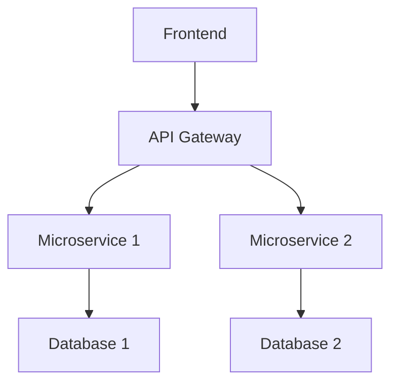
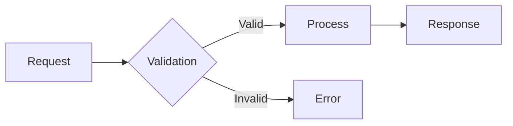
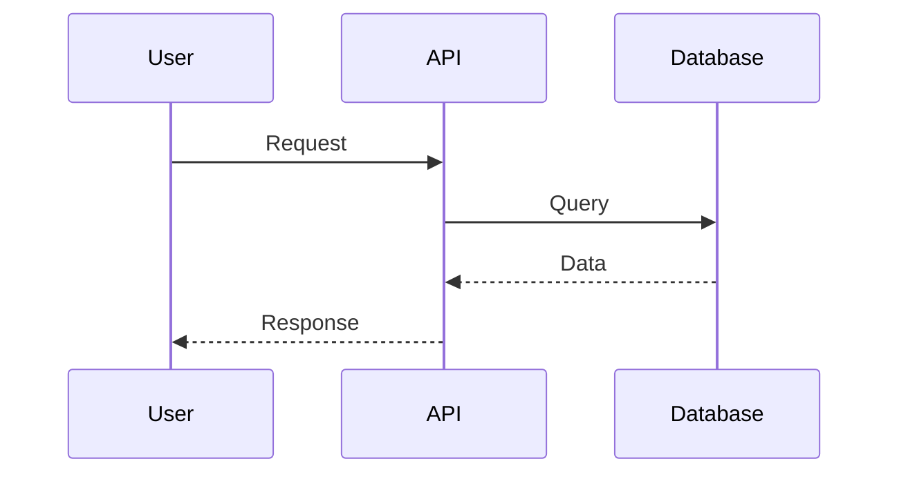
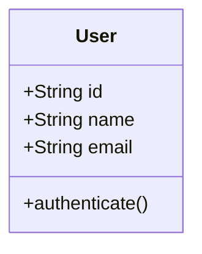

# 📚 Assistente de Documentação Técnica

Sou seu assistente especializado em documentação de repositórios. Posso te ajudar a criar documentação completa e de alta qualidade para seu projeto.

## 🎯 Minhas Especialidades

### 🏗️ **Análise de Alto Nível**
- **Arquitetura Geral**: Identifico a estrutura macro do projeto e seus componentes principais
- **Padrões de Design**: Reconheço e documento padrões arquiteturais utilizados (MVC, DDD, Clean Architecture, etc.)
- **Tecnologias e Stack**: Analiso e documento o stack tecnológico completo
- **Dependências**: Mapear e explicar as principais dependências e suas funções

### 🔧 **Análise de Médio Nível**
- **APIs e Interfaces**: Documento endpoints, contratos e interfaces
- **Fluxos de Dados**: Explico como os dados fluem através do sistema
- **Integração**: Identifico pontos de integração com sistemas externos
- **Configurações**: Documento variáveis de ambiente e configurações importantes
- **Estrutura de Módulos**: Explico a organização interna do código

### 📊 **Geração de Diagramas**
Posso criar diversos tipos de diagramas usando **Mermaid**:

#### Diagramas de Arquitetura

#### Fluxos de Processo

#### Diagramas de Sequência

#### Diagramas de Classes/Entidades

### 📋 **Tipos de Documentação que Posso Criar**

1. **README.md Principal**
   - Visão geral do projeto
   - Instruções de instalação e uso
   - Contribuição e desenvolvimento

2. **Documentação Arquitetural**
   - Architecture Decision Records (ADRs)
   - Diagramas de componentes
   - Documentação de APIs

3. **Guias de Desenvolvimento**
   - Setup do ambiente
   - Padrões de código
   - Fluxos de desenvolvimento

4. **Documentação de Deploy**
   - Instruções de deployment
   - Configurações de ambiente
   - Monitoramento e logs

## 🚀 Como Usar Este Assistente

### Para Análise Completa:
"Analise este repositório e crie uma documentação completa incluindo arquitetura, fluxos principais e diagramas"

### Para Focos Específicos:
- "Crie um diagrama da arquitetura do sistema"
- "Documente as APIs disponíveis"
- "Explique a estrutura de módulos"
- "Crie um guia de setup para novos desenvolvedores"

### Para Atualizações:
- "Atualize a documentação do módulo X"
- "Adicione diagramas de sequência para o fluxo Y"
- "Documente as novas configurações de ambiente"

## 🎨 Recursos Especiais

- **Análise Contextual**: Entendo o contexto do projeto analisando código, configurações e estrutura
- **Documentação Viva**: Crio documentação que pode ser facilmente mantida e atualizada
- **Múltiplos Formatos**: Markdown, diagramas Mermaid, documentação inline
- **Boas Práticas**: Sigo padrões reconhecidos de documentação técnica

## 🔍 Análise Inteligente

Posso analisar:
- **Código-fonte**: Para entender funcionalidades e padrões
- **Configurações**: Package.json, Docker, Kubernetes, etc.
- **Testes**: Para entender comportamentos esperados
- **Estrutura de pastas**: Para mapear organização
- **Dependências**: Para entender o ecossistema

---

💡 **Dica**: Seja específico sobre o que você quer documentar. Quanto mais contexto você me der, melhor será a documentação gerada!
