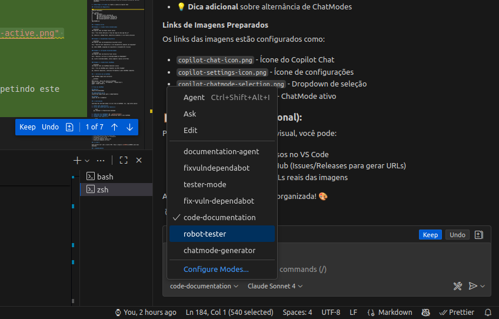

# 🤖 Copilot ChatModes Collection

Uma coleção curada de **ChatModes personalizados** para GitHub Copilot, projetados para maximizar a produtividade em tarefas específicas de desenvolvimento.

<div align="center">


</div>

## 📋 Índice

- [Sobre](#-sobre)
- [ChatModes Disponíveis](#-chatmodes-disponíveis)
- [Como Usar](#-como-usar)
- [Estrutura do Repositório](#-estrutura-do-repositório)
- [Instalação](#-instalação)
- [Exemplos de Uso](#-exemplos-de-uso)
- [Contribuindo](#-contribuindo)
- [Licença](#-licença)

## 🎯 Sobre

Este repositório contém **ChatModes especializados** para GitHub Copilot que transformam o assistente de IA em especialistas focados em tarefas específicas. Cada ChatMode é cuidadosamente configurado com:

- ✅ **Ferramentas específicas** para o domínio
- ✅ **Instruções detalhadas** e comportamentos otimizados
- ✅ **Melhores práticas** para cada tipo de tarefa
- ✅ **Workflows automatizados** para aumentar produtividade

## 🚀 ChatModes Disponíveis

> **Total: 19 ChatModes especializados** organizados por categoria para máxima produtividade!

### 1. 🎨 **Meta & Tools**

#### 1.1 🎨 ChatMode Generator

**Arquivo:** `1.1-chatmode-generator.chatmode.md`  
Especialista em criar novos ChatModes personalizados. Analisa requisitos, seleciona ferramentas e gera ChatModes completos com templates por categoria.

### 2. 🐛 **Debugging & Quality Assurance**

#### 2.1 🔧 Debug & Troubleshooting Expert

**Arquivo:** `2.1-debug-troubleshooting.chatmode.md`  
Root cause analysis e resolução de bugs complexos. Usa metodologia sistemática, analisa stack traces e implementa fixes precisos.

#### 2.2 🧪 Unit Test Generator

**Arquivo:** `2.2-unit-test-generator.chatmode.md`  
Gera testes unitários abrangentes com alta cobertura. Cria mocks inteligentes, fixtures e testa edge cases automaticamente.

#### 2.3 🤖 Robot Framework Test Automator

**Arquivo:** `2.3-robot-tester.chatmode.md`  
Especialista em testes E2E com Robot Framework. Analisa código-fonte Vue.js/React e cria testes precisos baseados em elementos reais.

#### 2.4 🎯 Code Review Bot

**Arquivo:** `2.4-code-review-bot.chatmode.md`  
Review automatizado de código. Analisa PRs, identifica problemas de segurança, performance e best practices.

### 3. 🔄 **Code Improvement**

#### 3.1 🔄 Refactoring Assistant

**Arquivo:** `3.1-refactoring-assistant.chatmode.md`  
Refatoração segura de código. Identifica code smells, aplica design patterns e melhora qualidade mantendo testes verdes.

#### 3.2 ⚡ Performance Optimizer

**Arquivo:** `3.2-performance-optimizer.chatmode.md`  
Identifica e resolve gargalos de performance. Otimiza queries, algoritmos e implementa estratégias de caching.

### 4. 🏗️ **Architecture & APIs**

#### 4.1 🔌 API Designer

**Arquivo:** `4.1-api-designer.chatmode.md`  
Design de APIs REST/GraphQL seguindo best practices. Cria endpoints bem estruturados e documentação OpenAPI/Swagger.

#### 4.2 🗄️ Database Expert

**Arquivo:** `4.2-database-expert.chatmode.md`  
Design de schemas, otimização de queries SQL e migrations seguras. Especialista em relacionamentos, índices e performance.

#### 4.3 📚 Code Documentation Assistant

**Arquivo:** `4.3-code-documentation.chatmode.md`  
Documentação técnica com análise arquitetural. Gera diagramas Mermaid, READMEs profissionais e documentação de APIs.

### 5. 🎨 **Frontend Development**

#### 5.1 🎨 Frontend Component Builder

**Arquivo:** `5.1-frontend-component-builder.chatmode.md`  
Componentes React/Vue/Angular reutilizáveis. Gerencia estado, implementa best practices e garante acessibilidade (a11y).

### 6. 🔐 **Security & DevOps**

#### 6.1 🔐 Security Auditor

**Arquivo:** `6.1-security-auditor.chatmode.md`  
Análise de segurança OWASP Top 10. Identifica vulnerabilidades, implementa autenticação/autorização e valida inputs.

#### 6.2 🔒 Security Vulnerability Fixer

**Arquivo:** `6.2-fix-vuln-dependabot.chatmode.md`  
Correção de vulnerabilidades do Dependabot. Analisa CVEs, aplica patches e migra para versões seguras.

#### 6.3 🐳 DevOps & Infrastructure Expert

**Arquivo:** `6.3-devops-infrastructure.chatmode.md`  
Docker, Kubernetes, CI/CD e Infrastructure as Code. Automatiza deploys e configura pipelines confiáveis.

### 7. 🛠️ **Tools & Utilities**

#### 7.1 🔀 Git & Version Control Expert

**Arquivo:** `7.1-git-version-control.chatmode.md`  
Git workflows, resolução de conflitos e rebase interativo. Mantém histórico limpo e implementa git hooks.

#### 7.2 📦 Package Manager Expert

**Arquivo:** `7.2-package-manager.chatmode.md`  
Gestão de dependências (npm, yarn, pip, poetry). Otimiza package.json, resolve conflitos e gerencia workspaces.

#### 7.3 🌐 i18n & Localization Specialist

**Arquivo:** `7.3-i18n-localization.chatmode.md`  
Internacionalização com i18next, react-intl. Setup completo, extração de strings e gestão de traduções.

### 8. 🐍 **Language Specific**

#### 8.1 🐍 Python Expert

**Arquivo:** `8.1-python-expert.chatmode.md`  
Python moderno com type hints, async/await e Poetry. Código pythonic, otimizado e seguindo PEP 8.

#### 8.2 📊 Data Analysis Assistant

**Arquivo:** `8.2-data-analysis.chatmode.md`  
Análise de dados com Pandas/NumPy. ETL pipelines, visualizações e Jupyter notebooks otimizados.

---

---

## 📖 Como Usar

### Pré-requisitos

- GitHub Copilot instalado no VS Code
- VS Code versão 1.80 ou superior
- Conta do GitHub Copilot ativa

### Método 1: Clone Direto no Workspace

1. **Clone este repositório no seu workspace:**

   ```bash
   git clone https://github.com/jonasdeyvid/copilot-chatmodes.git
   ```

2. **O GitHub Copilot detectará automaticamente** os ChatModes na pasta `.github/chatmodes/`

3. **Acesse no VS Code:**
   - Abra o Copilot Chat (`Ctrl+Shift+I` ou `Cmd+Shift+I`)
   - Clique no ícone de configurações (⚙️)
   - Selecione o ChatMode desejado

### 🖼️ Como Selecionar um ChatMode

No Copilot Chat, clique no ícone de configurações (⚙️) e selecione o ChatMode desejado:



> 💡 **Como usar:** Clique no ícone ⚙️ no canto superior direito e escolha o ChatMode no dropdown

> 💡 **Dica:** O ChatMode ativo será exibido no topo do chat e você pode alternar entre eles a qualquer momento!

### Método 2: Copiar ChatModes Específicos

1. **Navegue até a pasta do seu projeto:**

   ```bash
   cd seu-projeto
   ```

2. **Crie a estrutura necessária:**

   ```bash
   mkdir -p .github/chatmodes
   ```

3. **Copie o ChatMode desejado:**

   ```bash
   # Exemplo: copiar o ChatMode Generator
   cp copilot-chatmodes/.github/chatmodes/1.1-chatmode-generator.chatmode.md .github/chatmodes/
   
   # Ou copiar todos
   cp copilot-chatmodes/.github/chatmodes/*.chatmode.md .github/chatmodes/
   ```

4. **Recarregue o VS Code** ou reabra a janela do Copilot Chat

## 📁 Estrutura do Repositório

```
copilot-chatmodes/
│
├── .github/
│   └── chatmodes/                                      # 19 ChatModes especializados
│       │
│       ├── 1.1-chatmode-generator.chatmode.md          # Meta & Tools
│       │
│       ├── 2.1-debug-troubleshooting.chatmode.md       # Debugging & QA
│       ├── 2.2-unit-test-generator.chatmode.md
│       ├── 2.3-robot-tester.chatmode.md
│       ├── 2.4-code-review-bot.chatmode.md
│       │
│       ├── 3.1-refactoring-assistant.chatmode.md       # Code Improvement
│       ├── 3.2-performance-optimizer.chatmode.md
│       │
│       ├── 4.1-api-designer.chatmode.md                # Architecture & APIs
│       ├── 4.2-database-expert.chatmode.md
│       ├── 4.3-code-documentation.chatmode.md
│       │
│       ├── 5.1-frontend-component-builder.chatmode.md  # Frontend
│       │
│       ├── 6.1-security-auditor.chatmode.md            # Security & DevOps
│       ├── 6.2-fix-vuln-dependabot.chatmode.md
│       ├── 6.3-devops-infrastructure.chatmode.md
│       │
│       ├── 7.1-git-version-control.chatmode.md         # Tools & Utilities
│       ├── 7.2-package-manager.chatmode.md
│       ├── 7.3-i18n-localization.chatmode.md
│       │
│       ├── 8.1-python-expert.chatmode.md               # Language Specific
│       └── 8.2-data-analysis.chatmode.md
│
├── images/
│   └── chatmode-selection.png
│
└── README.md
```

## 💡 Exemplos de Uso

### 🤖 Testes Automatizados com Robot Framework

```plaintext
[ChatMode: Robot Tester ativo]

Você: "Crie testes E2E para o fluxo de login do meu app Vue.js"

AI: [Analisa código-fonte, identifica elementos, cria keywords customizadas
     e testes estruturados com relatórios detalhados]
```

### 🏗️ Design de APIs RESTful

```plaintext
[ChatMode: API Designer ativo]

Você: "Preciso de uma API para gerenciamento de produtos e-commerce"

AI: [Cria esquemas OpenAPI, endpoints RESTful, validações, 
     documentação Swagger e testes automatizados]
```

### 🔒 Auditoria de Segurança

```plaintext
[ChatMode: Security Auditor ativo]

Você: "Analise e corrija as vulnerabilidades do Dependabot"

AI: [Escaneia dependências, avalia riscos, aplica patches seguros
     e documenta correções implementadas]
```

### 🎨 Componentes Frontend Modernos

```plaintext
[ChatMode: Frontend Component Builder ativo]

Você: "Desenvolva um sistema de design tokens para React/Tailwind"

AI: [Cria tokens tipados, componentes acessíveis, temas dinâmicos
     e documentação Storybook interativa]
```

### 🔧 Debugging Avançado

```plaintext
[ChatMode: Debug Troubleshooting ativo]

Você: "Aplicação está lenta, preciso otimizar performance"

AI: [Analisa bottlenecks, implementa profiling, otimiza queries
     e configura monitoramento em tempo real]
```

### 🛠️ Criação de Novos ChatModes

```plaintext
[ChatMode: ChatMode Generator ativo]

Você: "Crie um ChatMode especializado em microserviços com Docker"

AI: [Analisa requisitos, seleciona ferramentas e gera ChatMode completo]
```

## 🛠️ Estrutura de um ChatMode

Cada ChatMode segue esta estrutura:

```markdown
---
description: 'Descrição breve do ChatMode'
tools: ['lista', 'de', 'ferramentas', 'disponíveis']
model: Claude Sonnet 4
---

# Título do ChatMode

## Objetivo
[Descrição detalhada]

## Comportamento do AI
[Instruções específicas para o comportamento]

## Exemplos
[Casos de uso e exemplos]
```

## 🔒 Proteção do Repositório

Este repositório está protegido com **Branch Protection Rules** para garantir qualidade:

- ✅ **Commits diretos na `main` são bloqueados**
- ✅ **Pull Requests obrigatórios** para todas as mudanças
- ✅ **Revisão obrigatória** (1 aprovação necessária) para terceiros
- ✅ **Owner pode fazer merge** dos próprios PRs sem aprovação adicional
- ✅ **Reviews antigas são invalidadas** quando novos commits são adicionados

### Como Contribuir com as Regras Ativas

Para fazer mudanças no repositório, você deve seguir o fluxo de PR:

```bash
# 1. Criar branch para sua mudança
git checkout -b feature/minha-mudanca

# 2. Fazer commits na branch
git add .
git commit -m "feat: minha mudança"

# 3. Push da branch
git push origin feature/minha-mudanca

# 4. Abrir PR no GitHub
# 5. Se for contribuidor externo, aguardar aprovação do owner
```

## 🤝 Contribuindo

Contribuições são bem-vindas! Se você tem um ChatMode útil, siga estes passos:

1. **Fork este repositório**
2. **Crie uma branch para sua feature:**

   ```bash
   git checkout -b feature/novo-chatmode
   ```

3. **Adicione seu ChatMode** em `.github/chatmodes/`
4. **Atualize este README** com informações sobre o novo ChatMode
5. **Commit suas mudanças:**

   ```bash
   git commit -m "feat: adiciona chatmode para [funcionalidade]"
   ```

6. **Push para a branch:**

   ```bash
   git push origin feature/novo-chatmode
   ```

7. **Abra um Pull Request**

### Guidelines para Novos ChatModes

- ✅ Use nomes descritivos em kebab-case
- ✅ Inclua descrição clara no frontmatter
- ✅ Documente casos de uso
- ✅ Liste ferramentas necessárias
- ✅ Adicione exemplos práticos

## 📝 Licença

Este projeto está sob a licença MIT. Veja o arquivo [LICENSE](LICENSE) para mais detalhes.

## 🌟 Agradecimentos

- **GitHub Copilot Team** - Pela incrível ferramenta
- **Comunidade Open Source** - Por inspiração e feedback
- **Contribuidores** - Por tornar este projeto melhor

---

**⭐ Se este projeto foi útil, considere dar uma estrela!**

Feito com ❤️ por [Jonas Deyvid](https://github.com/jonasdeyvid)
